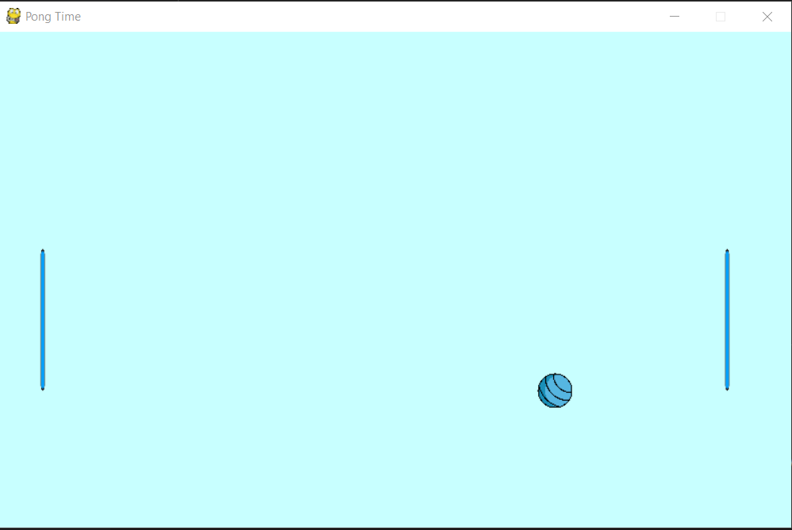

# ping-pong
game of ping pong built using python with the pygame library

This is the image of the prototype:


###How to run the game
This game was made by python 3, to run it you need to have 'python' installed in your device

It's made with the pygame library. You need to install the pygame library to python by using the commands below:

``` bash
    pip install pygame
```

after installing the dependiencies, you can run the command below to play the game

```bash
    python3 main.py
```

###Have fun!
